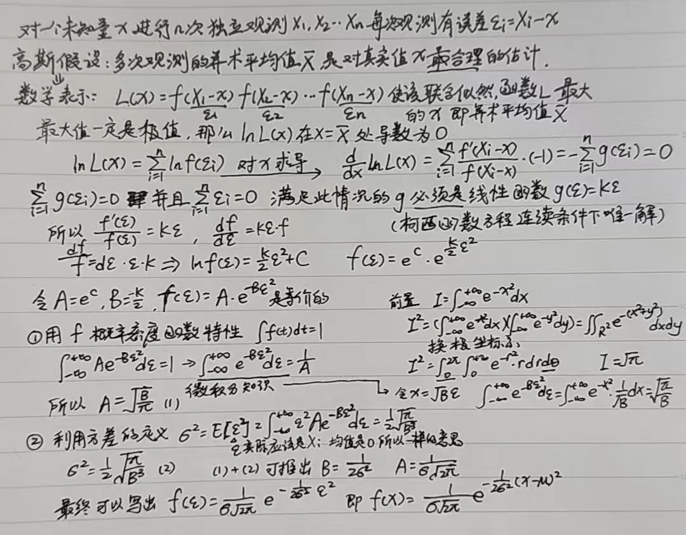

---
{
  title: 零基础理解SIGreg,
  date: 2026-07-25,
  publishedAt: 2026-07-25T16:20:38+08:00,
  updatedAt: 2026-07-25,
  tags: [ 数学, 概率, JEPA, 表征学习 ],
  draft: false,
  archive: true,
  badge: 理论,
  description: 从最基础的概统开始的SIGreg数学原理讲解（默认还是需要会一点微积分知识的）。,
  cover: ./26-7-25-assets/gauf.webp
}
---

<article-toc></article-toc>

SIGReg 是一种**正则化损失函数**，核心目标：让模型输出的高维嵌入向量$\boldsymbol \(\boldsymbol Z\)$的整体分布对齐**各向同性高斯分布$\mathcal N(0,\boldsymbol I)$（均值0、协方差为单位阵）**。
高维分布直接匹配难度极大，它借助**Cramér-Wold定理**+**Epps-Pulley(EP)单变量检验统计量**把高维匹配降解为大量一维分布匹配，下面分层拆解。

## 步骤1：随机采样球面单位方向

在$D$维单位超球面$\mathbb S^{D-1}$上均匀随机采样$M$个单位向量$\boldsymbol u^{(1)},\boldsymbol u^{(2)},...,\boldsymbol u^{(M)}$。
对每个方向做嵌入投影：
$$
\boldsymbol h^{(m)} \triangleq \boldsymbol \(\boldsymbol Z\) \boldsymbol u^{(m)}
$$
$\boldsymbol h^{(m)}$是把$D$维嵌入压缩得到的**一维投影变量**。
理想情况下，所有$\boldsymbol h^{(m)}$都应当服从一维标准正态$\(\mathcal N(0,1)\)$。

$D$维的球面为何是$D-1$维？

简单理解就是$D$维度下球面增加了一个约束条件，减少了一个自由度，所以是$D-1$维。

### 一维高斯分布的概率密度函数

<figure class="figure figure--lg figure--center">
  
  <figcaption class="figure-caption">一维高斯分布概率密度函数推导</figcaption>
</figure>

:::info[高斯分布]
以上从高斯假设开始推导。从信息论角度理解这句话就是**高斯分布熵最大**（在给定的均值和方差下）。因此也可以从熵角度推出前半部分的通式$f(x)=Ae^{-Bx^2}$。
:::

标准正态（高斯）分布$\(\mathcal N(0,1)\)$，对应就是$f(x)=\frac{1}{\sqrt{2 \pi}}e^{-\frac{x^2}{2}}$。

### 独立条件下的联合概率

根据定义得到的独立事件概率公式为$p(y|x)=p(y)$，带入条件概率公式$p(x,y)=p(x)p(y|x)$，得到

$$
\begin{equation}
p(x,y)=p(x)p(y)
\end{equation}
$$

:::note[怎么理解连续情况？]
在连续变量中，我们不讨论某一个孤立的点，而是一个极小的范围 $[x, x+dx]$，只要这个范围 $dx$ 足够小：

* 在这个区间内，概率密度 $p(x)$ 可以看作是常数。
* 这个微小区间内的真实概率就是 $p(x)dx$。

因为 $X$ 和 $Y$ 独立，**“两事件同时发生的概率等于各自概率之积”** 这个基本性质，在每一个微小区间上都成立：

$$
\underbrace{p(x,y) dx dy}_{\text{联合微小概率}} = \underbrace{\big[p(x) dx\big]}_{\text{X 的微小概率}} \times \underbrace{\big[p(y) dy\big]}_{\text{Y 的微小概率}}
$$

两边都有因子 $dx dy$，且 $dx \neq 0, dy \neq 0$，所以在代数上可以直接约去，从而得到密度函数之间的关系（常用的$f$就是这里的$p$）：

$$
p(x,y) = p(x)p(y)=f(x)f(y)
$$
:::

如果向量$x$各分量独立同分布且服从上述（1）一维标准高斯，那么有：

$$
p(x) = \prod_{i=1}^d f(x_i) = \prod_{i=1}^d \left( \frac{1}{\sqrt{2\pi}} e^{-x_i^2/2} \right)
$$

$$
\begin{equation}
p(x) = \frac{1}{(2\pi)^{d/2}} \exp\left( -\frac12 \|x\|^2 \right)
\end{equation}
$$

$p(x)$就是$D$维标准高斯分布的联合概率密度函数，描述向量$x$在$D$维空间某点出现的概率密度。

### 证明方向在球面上均匀随机

明确我们要证明的是$\mathbf{u}=\frac{x}{||x||}$方向在球面上均匀随机。$x$是每个分向量都满足独立高斯分布的一个向量。

> 一个$n$维几何图形，整体尺寸放大$k$倍，它的$n$维测度（长度/面积/体积）放大$k^n$。

- $r=||x||$：超球面半径
- $d\mathbf{u}$：超球面上的微小面积元
- $dx$：$d$维空间的体积微元

所以半径为r的超球面上的面积元放大为$r^{D-1} \cdot d\mathbf{u}$，那么可以得到：$dx=r^{D-1}d\mathbf{u}dr$。

要证明方向在超球面上均匀随机，就是要证明$p(u)$和$u$无关，很明显需要求$p(r,\mathbf{u})dr$的积分，我们依据上述（2）式和前面的$r=||x||$、$dx=r^{D-1}d\mathbf{u}dr$可以得到：

$$
\begin{aligned}
p(x)dx = \frac{1}{(2\pi)^{d/2}} \exp\left( -\frac12 \|x\|^2 \right)dx \\
= \frac{1}{(2\pi)^{d/2}} e^{-r^2/2} \cdot r^{d-1} dr d\mathbf{u} \\
= p(r, \mathbf{u}) dr d\mathbf{u}
\end{aligned}
$$

$$
\begin{equation}
p(r, \mathbf{u}) = \frac{1}{(2\pi)^{d/2}} \cdot r^{d-1} e^{-r^2/2}
\end{equation}
$$

（3）式已经不包含$u$，因此$p(r,u)dr$的积分也显然与$u$无关，只与$r$有关，是常值。也就是方向在超球面上是均匀随机的，但是位置和$r=||x||$相关，大致集中在$\sqrt{d-1}$附近（$\pm \frac{1}{\sqrt 2}$）。

:::note[现在发现SIGreg的问题了吧]
- 甚至距离还是随机的，人家[SPHERE-JEPA](https://arxiv.org/abs/2605.26900)和[Expanding SPHERE-JEPA](https://arxiv.org/abs/2606.17603)直接就把你干了，当然方法上不是这种数学路子
- 甚至没管一个视频当中不同帧分布，你欧氏距离完全就瞎搞，人家[TRM](https://arxiv.org/abs/2605.22164)直接把你干了
:::

## 步骤2：Epps-Pulley(EP)统计量：衡量一维分布差异
公式：
$$
T^{(m)} = \int_{-\infty}^{\infty} \(w(t)\)\big|\phi_N(t;\boldsymbol h^{(m)}) - \phi_0(t)\big|^2 dt
$$
作用：量化「投影数据$\boldsymbol h^{(m)}$的经验分布」和「标准正态分布」的差距。
分项说明：
1. **经验特征函数ECF $\phi_N(t;\boldsymbol h)$**
特征函数是分布的等价表征，用来刻画分布形态：
$$
\phi_N(t;\boldsymbol h)=\frac{1}{N}\Sigma_{n=1}^N e^{it h_n}
$$
$N$是样本总数；$h_n$是第$n$个样本的一维投影值；$i$为虚数单位。它是从真实数据统计得到的特征函数。

2. **目标特征函数$\phi_0(t)$**
目标是标准正态$\mathcal \(\mathcal N(0,1)\)$，其理论特征函数为$\phi_0(t)=e^{-t^2/2}$。

3. **加权函数$\(w(t)\)$**
示例：$\(w(t)\)=e^{-\frac{t^2}{2\lambda^2}}$，给不同频率$t$赋予权重，避免积分在$t\to\infty$发散，控制高频部分的权重。

4. 整体含义
对所有频率$t$，加权累加「数据特征函数和高斯特征函数的平方差」。
$T^{(m)}$越大，代表当前方向投影的分布离标准正态越远；$T^{(m)}\to0$代表一维投影完美符合标准正态。
5. 工程上选取一定范围内的离散点的值相加替代积分运算。

## 步骤3：SIGReg总损失：多方向平均
$$
\text{SIGReg}(\boldsymbol \(\boldsymbol Z\)) \triangleq \frac{1}{M}\Sigma_{m=1}^M T^{(m)}
$$
对$M$个随机方向的EP损失取平均，作为最终正则损失。

## 步骤4：收敛保证（Cramér-Wold收敛关系）

Cramér-Wold 克拉默-沃尔德定理：
> 两个$D$维随机分布完全相同 $\iff$ 这两个分布往**任意一维方向**投影得到的一维分布全部相同。

$$
\text{SIGReg}(\boldsymbol \(\boldsymbol Z\)) \to 0 \iff \mathbb P_{\boldsymbol \(\boldsymbol Z\)} \to \mathcal N(0,\boldsymbol I)
$$
当采样方向数$M$趋向无穷、SIGReg损失趋近0时，嵌入$\boldsymbol \(\boldsymbol Z\)$的整体分布弱收敛到各向同性高斯；
训练最小化SIGReg，等价于逼迫高维嵌入趋近球形高斯分布。
