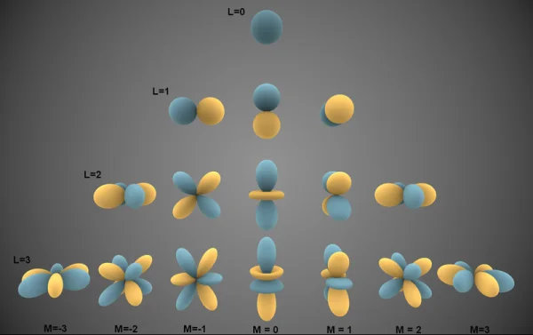

---
{
  title: 零基础理解球谐函数,
  description: 从拉普拉斯算子、本征方程开始到球谐函数全理解,
  date: 2026-07-28,
  publishedAt: 2026-07-28T14:00:53+08:00,
  updatedAt: 2026-07-28,
  tags: [ 数学, 球谐函数 ],
  draft: false,
  archive: true,
  badge: 理论,
  cover: ./26-7-28-assets/qiuxie.webp
}
---

<article-toc></article-toc>

以下介绍的还是三维球坐标空间。SPHERE-JEPA是高维坐标，下篇再说。不同于任何其他地方的教程，这篇教程会尽量以历史发展角度撰写，方便理解。

## 拉普拉斯算子与本征函数

三维全空间直角坐标系拉普拉斯算子：$
\nabla^2 = \frac{\partial^2}{\partial x^2} + \frac{\partial^2}{\partial y^2} + \frac{\partial^2}{\partial z^2}
$

它用来对整个三维空间任意函数做二阶偏导求和。标准球坐标下的全空间拉普拉斯算子为：

$$
\begin{equation}
\nabla^2 = \frac{1}{r^2}\frac{\partial}{\partial r}\left(r^2 \frac{\partial}{\partial r}\right) + \frac{1}{r^2}\nabla_S^2
\end{equation}
$$

:::note[怎么理解拉普拉斯算子]
一阶导表示它现在的扭曲程度怎么样，二阶导表示它即将怎么扭曲，所以拉普拉斯算子反映了一种“弹性倾向”。
:::

最初是因为需要求解引力势，$\nabla^2 \Phi= 0$（在无质量的真空区域，不允许存在“凸起”或“凹陷”，任意一点的值必须等于邻域均值）。

对（1）移项、消去化简得到：$-\frac{\partial}{\partial r}\left(r^2 \frac{\partial}{\partial r}\right) \Phi = \nabla_S^2 \Phi$。物理学家们偷了个懒，为了好解，把$\Phi$拆解成$R(r) \cdot Y(\theta, \phi)$，代入上式后两边同时除以$R\cdot Y$。

$$
-\frac{1}{R}\frac{d}{dr}(r^2 \frac{dR}{dr})=\frac{\nabla^2_S Y}{Y}
$$

左边只与r相关，右侧只与角度有关，两者恒等所以必然等同于一个常数，假设该常数为$\lambda$，于是我们就得到了球面拉普拉斯算子下的**本征方程**：

$$
\begin{equation}
\nabla^2_S Y = \lambda Y
\end{equation}
$$

:::info[本征方程通用定义]
$L[f]=\lambda f$叫做算子L的本征方程，$f$是本征函数，$\lambda$是本征值。
:::

## 求解本征函数

球面拉普拉斯算子为：

$$
\nabla_S^2=\frac{1}{\sin\theta}\frac{\partial}{\partial \theta}\left(\sin\theta \frac{\partial}{\partial \theta}\right)
+\frac{1}{\sin^2\theta}\frac{\partial^2}{\partial \phi^2}
$$

球面拉普拉斯本征方程：

$$
\nabla_S^2 Y = \lambda Y
$$

变量分离假设：$Y(\theta,\phi)=\Theta(\theta)\Phi(\phi)$，$\Theta$只和$\theta$有关，$\Phi$只和$\phi$有关。

:::note[变量分离是全部解]
> 泛函分析结论：可分离自伴随椭圆算子的$L^2$本征函数一定可以变量分离。

球面拉普拉斯是紧自伴随椭圆算子，在球面平方可积函数空间$L^2(S^2)$上，满足谱定理：
1. 本征值是离散可数集；
2. 全体本征函数构成空间标准正交完备基；
3. 对可分离自伴算子，存在一组由单变量函数乘积构成的本征函数完备正交基。
:::

### 步骤1：变量分离代入方程
分别求偏导：
$$
\frac{\partial Y}{\partial \theta}=\Phi \frac{d\Theta}{d\theta},\quad
\frac{\partial^2 Y}{\partial \phi^2}=\Theta \frac{d^2\Phi}{d\phi^2}
$$
代入算子：
$$
\frac{1}{\sin\theta}\frac{\partial}{\partial\theta}\left(\sin\theta\cdot \Phi \frac{d\Theta}{d\theta}\right)
+\frac{1}{\sin^2\theta}\cdot \Theta \frac{d^2\Phi}{d\phi^2}
=\lambda \Theta \Phi
$$
$\Phi$和$\theta$无关，可以提出第一个括号外：
$$
\frac{\Phi}{\sin\theta}\frac{d}{d\theta}\left(\sin\theta \frac{d\Theta}{d\theta}\right)
+\frac{\Theta}{\sin^2\theta}\frac{d^2\Phi}{d\phi^2}
=\lambda \Theta \Phi
$$

等式两侧同乘 $\dfrac{\sin^2\theta}{\Theta \Phi}$ 做分离，整理全式得：
$$
\underbrace{\frac{\sin\theta}{\Theta}\frac{d}{d\theta}\left(\sin\theta \frac{d\Theta}{d\theta}\right)}_{\text{只含变量}\theta}
+\underbrace{\frac{1}{\Phi}\frac{d^2\Phi}{d\phi^2}}_{\text{只含变量}\phi}
=\lambda \sin^2\theta
$$

### 步骤2：变量分离核心逻辑

式子左边第一项**只跟$\theta$有关**，第二项**只跟$\phi$有关**；右边同时包含$\theta$，不含$\phi$。
对等式做移项：
$$
\frac{1}{\Phi}\frac{d^2\Phi}{d\phi^2}
=
\lambda \sin^2\theta
-\frac{\sin\theta}{\Theta}\frac{d}{d\theta}\left(\sin\theta \frac{d\Theta}{d\theta}\right)
$$
- 左边：完全没有$\theta$，无论$\theta$取何值，左边都不会变；
- 右边：完全没有$\phi$，无论$\phi$取何值，右边都不会变。

等式两边互不依赖对方变量，唯一成立的可能：两边等于**同一个常数**，记这个常数为 $-m^2$。

整理后得到两条等式：

$$
\begin{equation}
\frac{d^2\Phi}{d\phi^2}=-m^2 \Phi
\end{equation}
$$

$$
\begin{equation}
\lambda \sin^2\theta
-\frac{\sin\theta}{\Theta}\frac{d}{d\theta}\left(\sin\theta \frac{d\Theta}{d\theta}\right)
=-m^2
\end{equation}
$$

### 步骤3：方位角方程完整求解+周期性约束（定m必须为整数）
$$\Phi''=-m^2\Phi$$
通解：
$$
\Phi(\phi)=A e^{im\phi}+B e^{-im\phi}
$$
硬性边界条件：$\phi$是绕z轴旋转角，旋转一周$2\pi$函数必须复原：
$$
\Phi(\phi+2\pi)=\Phi(\phi)
$$
代入（3）：
$$
Ae^{im(\phi+2\pi)}+Be^{-im(\phi+2\pi)}=Ae^{im\phi}+Be^{-im\phi}
$$
化简：$e^{i2\pi m}=1$。根据欧拉公式 $e^{i\alpha}=\cos\alpha+i\sin\alpha$，只有$m\in \mathbb Z$（整数）时$\cos(2\pi m)=1,\sin(2\pi m)=0$，等式成立。

**结论：$m=0,\pm1,\pm2,\pm3,\dots$，m必须是整数。**

### 步骤4：整理极角方程，得到连带勒让德方程

对（4）做移项整理：
$$
\frac{\sin\theta}{\Theta}\frac{d}{d\theta}\left(\sin\theta \frac{d\Theta}{d\theta}\right)
=\lambda\sin^2\theta+m^2
$$

两边同乘$\Theta$后得到标准形式：

$$
\sin\theta \frac{d}{d\theta}\left(\sin\theta \frac{d\Theta}{d\theta}\right)
+\left(-\lambda \sin^2\theta-m^2\right)\Theta=0
$$
做变量替换 $u=\cos\theta$，$du=-\sin\theta d\theta$，$\sin^2\theta=1-u^2$，方程转为**标准连带勒让德方程**：
$$
(1-u^2)\frac{d^2\Theta}{du^2}-2u\frac{d\Theta}{du}
+\left(-\lambda-\frac{m^2}{1-u^2}\right)\Theta=0
$$

定义域$\theta\in[0,\pi]$，对应$u\in[-1,1]$，$u=\pm1$对应球面南北极点。

### 步骤5：极点有界性约束求解本征值

通过最简单情况$m=0$入手，方程简化为普通勒让德方程：
$$
(1-u^2)\Theta''-2u\Theta'+\lambda\Theta=0
$$

设幂级数解：$\Theta(u)=\sum_{k=0}^\infty a_k u^k$
求导：
$$
\Theta'=\sum_{k=1}^\infty k a_k u^{k-1},\quad \Theta''=\sum_{k=2}^\infty k(k-1)a_k u^{k-2}
$$
全部代入方程，对齐同次幂$u^k$，得到系数递推关系：
$$
a_{k+2}=\frac{k(k+1)+\lambda}{(k+2)(k+1)} a_k
$$

若级数有无穷多项（永远不截断）：$k\to\infty$时，
$$
\frac{a_{k+2}}{a_k}\approx \frac{k^2}{k^2}=1
$$
根据幂级数收敛判别法，收敛半径$\(R=1\)$。这意味着：
$u=\pm1$正好在收敛边界，无穷级数会发散到无穷大。

但自然边界条件下，$u=\pm1$处$\Theta$有限。级数只能在某一项截断，变成有限次多项式，假设此项为$a_{l+2}$，而$a_{l \ge 0}$不为0，那么就有$l(l+1)+\lambda=0$，截断条件就是：

$$
\lambda=-\(l(l+1)\),\quad l=0,1,2,3\dots
$$

对于连带勒让德方程无非是分子进行了改动，需要满足：

$$
\exists\ k,k(k+1)-l(l+1)+\frac{m^2}{1-u^2} \le 0
$$

那么显然需要$|m| \le l$。

### 步骤6：求解

对极角方程具体求解略过。直接给具体解：
- $m=0$时，方程唯一合法有界解为罗德里格斯公式（勒让德多项式）

$$
P_l(x) = \frac{1}{2^l l!} \frac{d^l}{dx^l} [(x^2 - 1)^l]
$$

- 连带勒让德函数
$$
P_l^{m}(x) = (-1)^m (1-x^2)^{\frac{m}{2}} \frac{d^m}{dx^m}P_l(x),(m \ge 0)
$$

$$
P_l^{-|m|}(x)=(-1)^{|m|}\frac{(l-|m|)!}{(l+|m|)!}P_l^{|m|}(x),(m < 0)
$$

- 复数球谐函数

$$
\begin{equation}
Y_l^m(\theta,\varphi) = \underbrace{(-1)^m \sqrt{\frac{2l+1}{4\pi}\cdot\frac{(l-|m|)!}{(l+|m|)!}} P_l^{|m|}(\cos\theta)}_{极角解} \underbrace{e^{im\varphi}}_{方位角解}
\end{equation}
$$
适用范围：$l=0,1,2,3\cdots$；$m=-l,-l+1,\dots,0,\dots,l-1,l$

## 球谐函数

球谐函数$Y_l^m(\theta,\phi)$具备正交性和完备性，与此前直线/平面上的傅里叶级数一致，可以作为基函数。**我们可以通过球谐函数加权和模拟球面每个点的所有振动情况。**

以下为两种更严谨的表述：
- 任意定义在球面$S^2$上的平方可积函数（能量有限），都可以展开成球谐函数的加权和。
- 任意频率固定的球面波，可以展开为径向函数（球贝塞尔函数）与球谐函数（角度花纹）乘积的加权和。

在绝大多数球谐函数的科普视频或文章当中都会有这张图：

<figure class="figure figure--lg figure--center">
  
</figure>

这张图其实是实球谐的图。实球谐需要对（5）复球谐$Y_l^m$和$Y_l^{-m}$做线性组合，消去虚部。
- 根据$Y$的值上色，蓝色为正，黄色为负。
- 这些曲面表面的点到原点的径向长度等于$|Y_l^m(\theta,\phi)|$。
- 曲面上任意一个三维点，球坐标的极角$\theta$、方位角$\phi$，完全等于代入球谐$Y_l^m(\theta,\phi)$的那两个自变量。

从图中也可以理解$l$和$m$一些。
- $l$决定花瓣总层数，越大代表球面频率越高，褶皱越多。
- $m$决定形态绕z轴的旋转朝向。$m=0$永远沿z轴上下伸展；$m≠0$分布在 xy 水平面，$|m|$越大，绕赤道分割越多。

## 拓展

波动方程：
$$u_{tt}=\nabla^2 u$$
分离变量：$u=T(t)Y(\theta,\phi)$，$Y$为球面角度函数。两边代入：

$$
T''(t)\cdot Y = T(t)\cdot \nabla^2 Y
$$

把$\nabla^2 Y=-l(l+1)Y$代入波动方程，两边约去不为零的$Y$：
$$
T''=-l(l+1)\,T
$$

简谐振动标准形式：$T''=-\omega^2 T$，只有右端带负号，解才是三角函数振荡；若系数为正，解是指数发散，不存在振动。
直接一一对应：

$$
\omega=\sqrt{l(l+1)}
$$

$l$是球面角向谐波阶数，$l$越大，$\omega$越大，振动频率越高，这与上一节图中所说$l$的含义一致。

经典简谐振动能量$E\propto \omega^2$，因此$E\propto l(l+1)$：
$l$越大，频率越高，振动能量越大。（本征值$\lambda$反映能量）

:::note[量子转动动能也正比于$\lambda$]
量子转动动能公式为：$$
E_\text{rot}=\frac{\langle L^2\rangle}{2\mu r^2}=\frac{\(l(l+1)\)\hbar^2}{2\mu r^2}$$
:::

:::info[谱]
算子的谱就是所有求解出来的$\lambda$的集合。

谱理论的体现：球面是紧致闭曲面，微分算子只有离散本征值，能量 / 频率不能连续任意取值，只能一份一份分立出现。
:::

