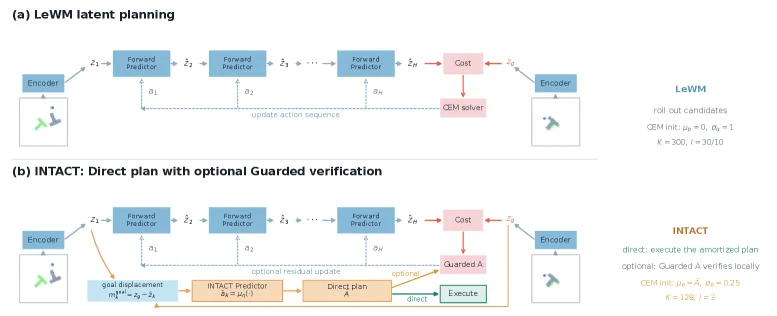

---
{
  title: INTACT-JEPA 到底做了什么,
  date: 2026-07-31,
  publishedAt: 2026-07-31T18:44:15+08:00,
  updatedAt: 2026-07-31,
  tags: [ JEPA, WM ],
  draft: false,
  archive: true,
  badge: 论文,
  description: INTACT-JEPA 写的不好，创新点和网络设计一样，并没有像 reg 那样有太多理论支撑。,
  cover: /essay/26-7-31.png
}
---

前两天浙大清华联合发布并开源了 [INTACT-JEPA](https://arxiv.org/abs/2607.26056v1)。这篇文章读起来极端的佶屈聱牙，但其实干的事没有看起来那么复杂。

和GC-IDM类似，它新增一个网络监督学习来输出动作。

<figure class="figure figure--lg figure--center">
  
  <figcaption class="figure-caption">INTACT-JEPA框架</figcaption>
</figure>

输入包含以下四个部分：
1. ：当前画面的$z_t$视觉潜向量
2. $m_t$：运动意图
3. $z_t \odot m_t$：状态 × 意图逐元素相乘（环境对动作的约束，比如有障碍物不能直走）
4. $A_\omega(a_{t-1})$：上一段动作通过一层向量张成和 $z_t$ 尺寸一致的向量

运动意图它区分了一下什么 $m_{local}$ 和 $m_{goal}$，令人困惑。训练的时候是滑动窗口，比如我拿一个视频的6帧($z_{t}-z_{t+5}$，其中 $z_{t+5}$ 是 $z_{goal}$)。那么：

$$
m_{local}=z_{t+j+1}-z_{t+j}, m_{gloabl}=z_{goal}-z_{t+j} (j \in [0,4])
$$

一个滑动窗口内，一轮动作的监督学习会依次拿这两个运动意图向量扔进去训练。6帧的滑动窗口总共就是5轮。其中的 $z_{goal}$ 会断开梯度传播。

好了，这篇文章就这么点东西，其他的东西都比较工程，像是打补丁的工作。

1. 它说可以支持四个任务，本来LeWM那个编码器干一个任务的记忆就大材小用了。然后它自己设计的网络反而还需要进行任务分别适配输出头，就挺好笑的。
2. 它网络直接输出在复杂任务上还需要配一个所谓的“Guarded A”，其实就是在输出附近采样，然后一些场景还需要复用LeWM的CEM，这太像补丁了。

既然开源了，过几天尝试复现一下，看看是否真的表现如论文说得那么好。
