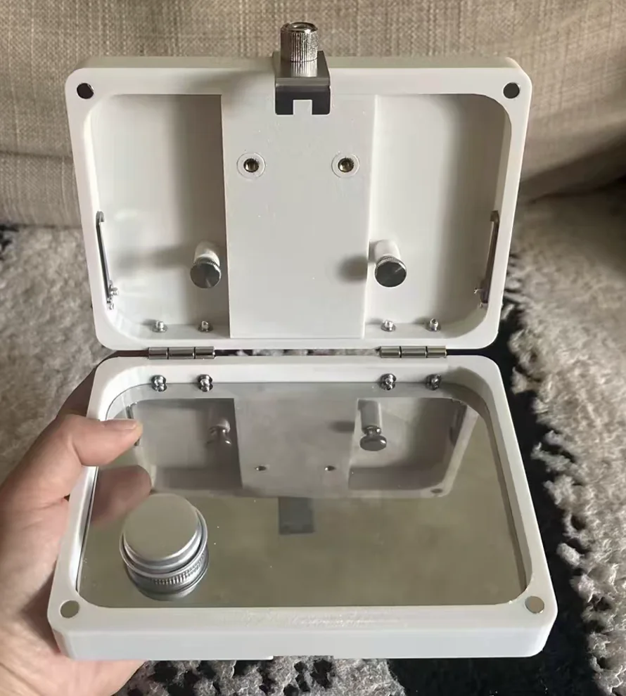
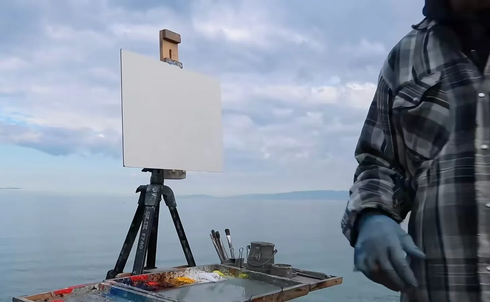

---
{
  title: 油画爱好者需要购买哪些工具？,
  date: 2026-08-11,
  publishedAt: 2026-08-11T19:39:28+08:00,
  updatedAt: 2026-08-12,
  tags: [ 油画, 教程 ],
  draft: false,
  archive: true,
  badge: 绘画,
  cover: ./26-8-11-assets/foreign.webp,
  description: 本文为想要油画写生的初学者分享了一套总价不到400元的平价油画全套装备清单，涵盖画笔、油画颜料、便携画箱、油画媒介等物件和收纳方案。
}
---

主要是分享一下作为初学者，**贫民打法**，我最后选择的全部装备。（非618）叠劵后共371.53块。

1. 榭得堂猪鬃笔：双号6支（+勾线笔），2支平峰（#7+#11），1支#6扇形，pdd 30块
2. 国产温莎牛顿颜料：（170ml）钛白，（45ml）柠檬黄、中黄、土黄、大红、深红、钴蓝、群青、宝石翠绿、天蓝、熟褐、象牙黑，tb-winsornewton旗舰店 95块
   - 爱好者级别；同级别国产温莎牛顿外，还有毕加索、马利1919系列
   - 专业入门级：贝碧欧、马利艺术家系列（也是比较目前主流使用的入门）
3. 3D打印的画箱（带一孔油壶和不锈钢调色盘），tb-青岚画材 145块

<figure class="figure figure--sm figure--center">
  
</figure>

4. 马利的木头调色盘，tb-马利专卖店 10块
5. 一套不知名品牌的刮刀，tb-天天特卖 不到10块
6. 中号笔筒，tb-好货严选工厂 25块
7. 229ml贝碧欧稀释剂，tb-绘画甄选 14块
8. 钉枪+赠送的U型钉，tb-得力博世专卖店 30块
9. 折叠椅，pdd 5块
10. A4透明文件资料盒5cm高，tb-尔曼彤旗舰店 11块

以上配置是针对我自己的情况（写生+小画幅为主）调整的，适当说明一下：
1. 写生可以不带调色油，一次画成，所以我只买单孔油壶 + 稀释剂/松节油
2. 油画画箱怎么挑选？
   - 市面上比较好的画箱价格至少在420块以上，七八百块的比较多，简单拆解一下核心需求就是：架画 + 调色 + 小幅画写生需求（户外耐造 + 便携，不需要装东西也可以）
   - 便宜的木质画箱不刷油，还是用的不锈钢/亚克力调色盘这就很不好，不如买更便宜的3D打印版本，**材质一定一定要选PETG，不要PLA**！
   - 小画幅并不总是需要三脚架，放腿上也是可以的（小红书博主：李斯基）这能省不少钱，先生。
   - 我是先根据写生需求买小的，以后有需求再买大的也不迟，买中号就非常不上不下了。
3. 由于画箱不装东西，所以需要额外购买装画笔 + 颜料的容器。我选择A4透明文件资料盒！
   1. 尺寸够大，可以装下大调色盘，允许以后我画更大的写生。
   2. 以后可以买那种带托盘的三脚架（搜“户外摆摊理发金属镜架”），把调色盘和资料盒盖放上去，一点也不比国外写生那种架子（下图）差。
   
   
   
   3. 如果确定未来不需要，那么购买一个油画笔袋+小铁盒装颜料也是一种配置。
  
最后感谢一下up主临班不知名的视频教学。对于初学者的我的购买挑选有着莫大的作用！

::link-card[B站视频：给想要接触油画的初学者的油画介绍和购买建议]{url="https://space.bilibili.com/13990270/lists/122677?type=season"}
