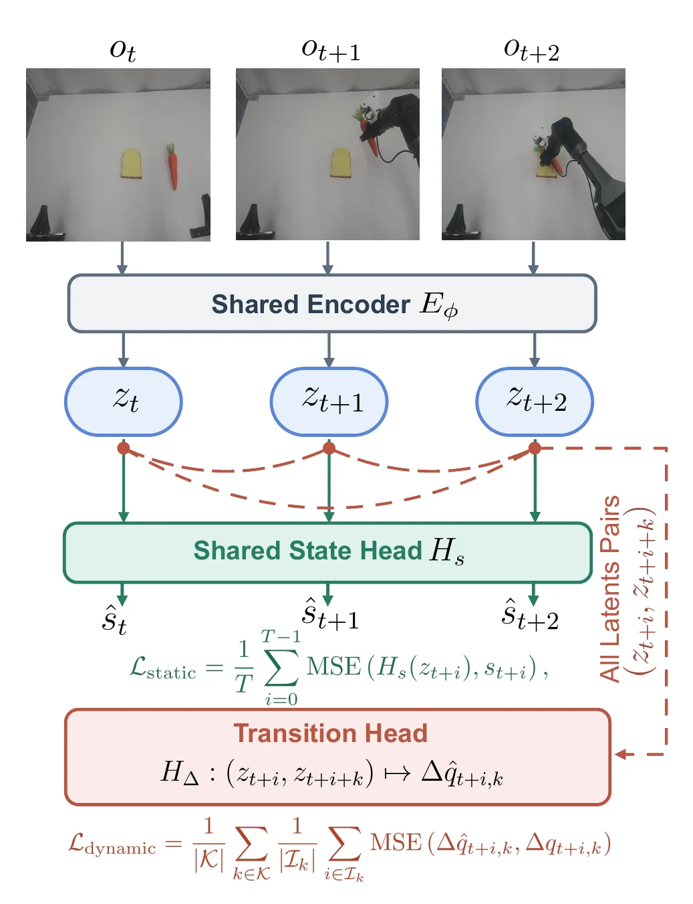

---
{
  title: 从PSG-JEPA开始思考,
  date: 2026-08-12,
  publishedAt: 2026-08-12T22:16:36+08:00,
  updatedAt: 2026-08-12,
  tags: [ JEPA, WM ],
  draft: false,
  archive: true,
  badge: 论文,
  description: PSG-JEPA用双预测头将隐向量分别与机体状态及状态增量对齐，印证了人工先验越丰富、模型收敛越快的个人观点。未来若能融入触觉等模态，抓取稳定性可进一步提升。当前方案本质是折中，真正的挑战在于多模态。,
  cover: /essay/26-8-12.png
}
---

8月初的[PSG-JEPA](https://arxiv.org/abs/2608.06799v1)让我确实眼前一亮。我之前貌似没太看到有真正将类似LeWM这样的以JEPA世界模型为核心的机器人控制模型真正实际部署的文章。（作者人数颇多估计也是部署难度较大，采集数据导致的）

这篇文章核心idea非常好懂，弄了两个预测头分别将隐式向量状态和机体自身状态、隐式向量的变化量和机体状态变化量进行MSE对齐。

<figure class="figure figure--sm figure--center">
  
  <figcaption class="figure-caption">PSG-JEPA结构</figcaption>
</figure>

我之前一直就说（可能博客里面没写）就是一个东西往里面掺入的人工先验成分越多，它就能越快收敛/越好用。这句话不是那么严谨，但是这篇文章也体现了我的意思。它加入了更多的信息去“钳住”训练方向。这个状态和增量的信息对齐就是加入的人工先验知识。

根据这个思路想下去，如果我们再进一步加入触觉的模态，隐式向量的增量需要有体现触觉的变化。那就能拿得更稳了。

但是我认为这篇文章这么做更像是折中。人自己毫无疑问（在不被“幻觉“影响情况下大概）知道自己身体的状态然后做决策，那么也就是说机体状态本身和照片的地位是同等的。

论文不这么干是因为多模态会比这难做100倍（虚数）。先不考虑所有数据都能准时、准确地拿到，光是数据波特率不同、异步都是个麻烦。虽然困难，但我觉得这是一个必须去攻克的坎，而不是任何其他的框架或模式。