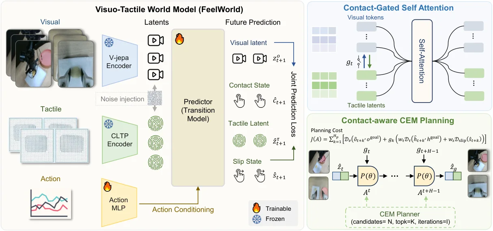

---
{
  title: 从两篇论文聊聊多模态世界模型,
  date: 2026-08-18,
  publishedAt: 2026-08-18T21:52:47+08:00,
  updatedAt: 2026-08-18,
  tags: [ WM, JEPA ],
  draft: false,
  archive: true,
  badge: 论文,
  description: 当前多模态JEPA研究尚处起步，思路各异未成趋势。FeelWorld的门控融合思路值得借鉴。UniJEPA直接暴力缝合。,
  cover: public/essay/28-8-18.png
}
---

第一篇是[FeelWorld](https://ar5iv.labs.arxiv.org/html/2607.24267#3)，提出了一套方法把不同模态的编码器融合到一起，如图所示：

比较有人工“先验”的设计（这类设计往往有利于提升模型效果、加快收敛）包括：
1. 三种对于接触的描述：接触状态、3D触觉隐变量、滑动状态
2. 视觉和触觉隐变量的关系：触觉始终吸收视觉特征（没接触时不那么轻易被异常值干扰），视觉特征仅在预测到接触时融合触觉特征

第二篇是[UniJEPA](https://arxiv.org/html/2608.07409v1)

这篇比较缝，几乎就是LeWM加了V-JEPA，整合一下视频数据和图像数据，让encoder和predictor同时训练。这样encoder和predictor网络也具备光照的处理能力。（论文里面的图不直观，像是刻意避嫌）

整体上多模态融合的JEPA相关工作并不多，加上之前的PSG-JEPA。也有[Le Mumo JEPA](https://arxiv.org/html/2603.24327v2)这样更改encoder网络来容纳多种模态的计算机方向工作。每一篇思路都独一无二，没有出现特定的趋势。

个人认为FeelWorld这篇门控的思路是非常好的，多模态的信息一定存在互补，但是也要注意到多模态信息可能存在的冗余，利用这些冗余或许可以做一些交叉验证。

