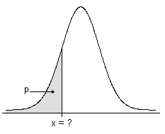

---
{
  title: VISreg的思路,
  date: 2026-08-07,
  publishedAt: 2026-08-07T22:18:42+08:00,
  updatedAt: 2026-08-07,
  tags: [ JEPA, 数学, 表征学习 ],
  draft: false,
  archive: true,
  badge: 论文,
  description: VISreg的核心理念是将JEPA表征分布的尺度与几何形状完全解耦，它不用单一的式子来评判表征分布的好坏。,
  cover: /essay/26-8-7.png
}
---

[VISreg](https://arxiv.org/abs/2606.02572v1)的核心理念是将表征分布的尺度与几何形状完全解耦，它不用单一的式子来评判表征分布的好坏。

$$
\mathcal{L}_\mathrm{Reg} = \lambda_\mathrm{scale}\mathcal{L}_\mathrm{scale} + \lambda_\mathrm{shape}\mathcal{L}_\mathrm{shape} + \lambda_\mathrm{center}\mathcal{L}_\mathrm{center}
$$

## 前置说明

- $z\in\mathbb{R}^{N\times D}$：一批$N$样本、$D$维投影表征；
- $\hat{Z}=z-\mu$：中心化表征，$\mu=\frac{1}{N}\sum_{i=1}^N z_i$为批次均值；
- $K$：随机投影切片数量；
- $\mathcal{L}_{scale},\mathcal{L}_{shape},\mathcal{L}_{center}$：分别是尺度损失、几何形状损失和中心化损失
- $\lambda$：正则项整体权重。

## 中心化损失

强制表征批次均值趋近原点，稳定分布偏移，加速收敛：

$$
\mathcal{L}_{center}=\|\mu\|_2^2=\left\|\frac{1}{N}\sum_{i=1}^N z_i\right\|_2^2
$$

消除表征整体偏移，降低尺度/形状优化压力，消融实验证明可小幅提升精度、大幅加快收敛。

## 尺度损失
对中心化表征$\hat{Z}$逐维约束标准差$\sigma_j\to1$：

$$
\mathcal{L}_{scale}=\frac{1}{D}\sum_{j=1}^D \big(1-\sigma_j(\hat{Z})\big)^2
$$

$\sigma_j(\hat{Z})=\sqrt{\frac{1}{N}\sum_{i=1}^N (\hat{Z}_{i,j})^2}$为第$j$维无偏标准差。

**核心优势**：当表征坍塌（所有维度$\sigma_j\to0$），梯度趋近常数，持续提供修正信号；对比SIGReg坍塌梯度归零，能稳定把模型拉出坍缩区域。

## 形状损失

1. 归一化解耦尺度：$\tilde{Z}=\displaystyle\frac{\hat{Z}}{sg(\sigma)+\epsilon}$，$\epsilon=10^{-8}$ 防止除零；
2. 生成$K$个随机单位投影方向矩阵$W\in\mathbb{R}^{D\times K}$ （列向量每个位置高斯随机采样后整体归一化），投影得到$K$组一维样本：$P=\tilde{Z}W\in\mathbb{R}^{N\times K}$

> Cramér-Wold定理：高维分布等价，当且仅当沿所有随机一维方向的投影分布完全一致。

前面几步和 SIGreg 基本一致，因为都利用 Cramér-Wold定理。但是注意这里第一步截断了梯度，这是为了让形状损失仅优化分布几何，**完全不影响各维度标准差（尺度）**。这是VISReg区别于SIGReg的关键设计。

但是VISreg让分布等价的方式有点不同，先理解这个 $P$ 的每个列向量，它表示N组D维表征在一个方向上的N个投影值。

4. 逐列升序排序$\text{sort}(P,dim=0)$；
5. 构造标准高斯目标分位数：$u=\frac{1,2,\dots,N}{N+1},q_{\mathcal{N}}=\text{Normal}(0,1).\text{icdf}(u)$；

icdf是逆累积分布函数，输入概率，输出标准正态下对应数值（分位数）。下图中的p和x。

<figure class="figure figure--center">
  
  <figcaption class="figure-caption">逆累积分布函数</figcaption>
</figure>

6. 计算所有切片的平均$W_2^2$：

$$
\mathcal{L}_{shape}=\frac{1}{K}\sum_{k=1}^K \big\|\text{sort}(\tilde{Z}w_k)-q_{\mathcal{N}}\big\|_2^2
$$

$W_2$叫二阶Wasserstein距离，听起来高级，其含义就是从一个分布到另一个分布的最小运输方案（距离）。这里的$W_2^2$其实就是算MSE。

这4-6步其实就是希望N组表征在所有投影上都满足正态分布，强制分布趋近各向同性高斯。

## VISreg、SIGreg和Expanding SHERE-JEPA的对比说明

SIGreg和VISreg都包含一步就是投影到一维向量上，让损失去推动N组表征在K个方向上都正态分布。因为超球面均匀分布就是正态分布的，见[SIGreg](https://walavave.github.io/archive/26-7-25/)当中的推导。

而Expanding SPHERE-JEPA是直接把表征按到单位球上，让损失去推动它们符合均球面均匀分布的各种数学特征。
